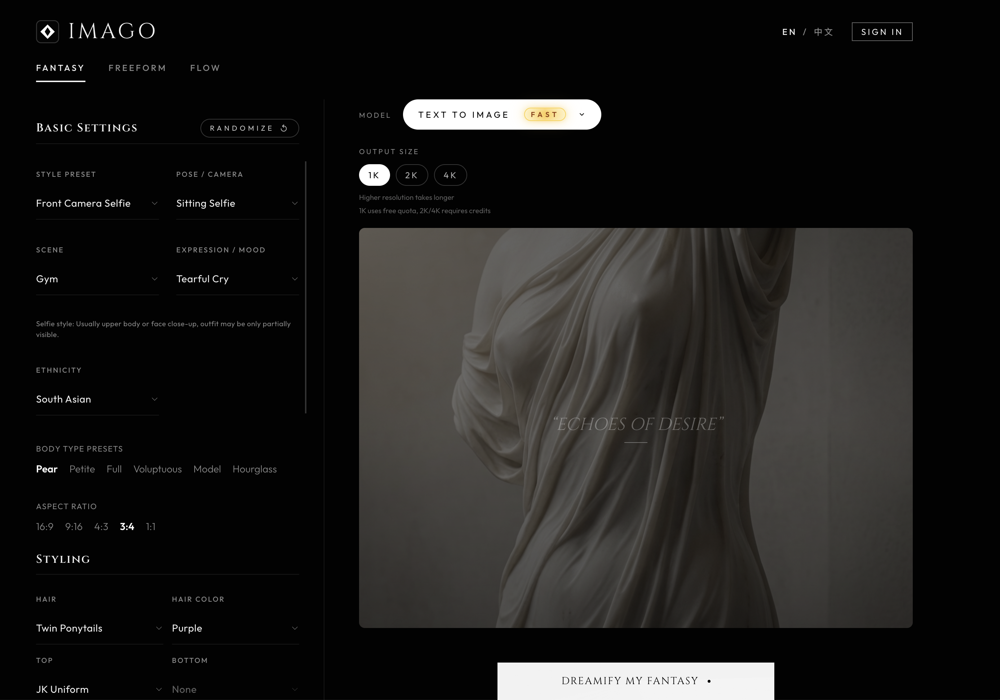

# Imago

[English](./README.md) | **中文**

**Imago** 是一个开源的全栈 AI 图像生成应用架构，专为构建高性能、现代化的生成式 AI 产品而设计。

它脱胎于成熟的商业项目，提供了一整套从**用户系统**、**积分支付**到**Prompt 构建**、**图像/视频生成**的完整解决方案。

Prompt 模块已单独开源为 [Imago Portrait Prompt](https://github.com/tenngoxars/imago-portrait-prompt)。



## 核心特性

- **🎨 多模式生成**：支持 Fantasy（预设风格）、Freeform（自由发挥）和 Flow（视频生成）三种核心模式。
- **🔐 完整的用户系统**：基于 Supabase Auth，支持邮箱登录、社交登录。
- **💰 积分与支付**：集成了 Stripe 支付流程，包含完整的充值 Modal、Webhook 回调和积分扣除逻辑。
- **🧠 智能 Prompt**：内置复杂的 Prompt 构建与清理逻辑（Humanizer），支持预设词、负向提示词自动补全。
- **⚡️ 高性能架构**：Next.js App Router + Tailwind CSS + Supabase，针对生产环境优化。
- **📱 响应式设计**：精心打磨的 Mobile/Desktop 双端体验，极致的深色模式 UI。

## 技术栈

- **Frontend**: [Next.js 14+](https://nextjs.org/) (App Router), [Tailwind CSS](https://tailwindcss.com/)
- **Backend/Database**: [Supabase](https://supabase.com/) (PostgreSQL, Auth, Edge Functions)
- **Payment**: [Stripe](https://stripe.com/)
- **State Management**: React Hooks + URL State
- **Types**: TypeScript 全覆盖

## 快速开始

### 1. 克隆项目

```bash
git clone https://github.com/tenngoxars/imago.git
cd imago
```

### 2. 安装依赖

```bash
npm install
```

### 3. 环境配置

复制 `.env.local.example` 到 `.env.local` 并填写配置。详细配置说明请参考 [环境配置指南](docs/setup.md)。

```bash
cp .env.local.example .env.local
```

### 4. 启动开发服务器

```bash
npm run dev
```

访问 `http://localhost:3000` 即可看到应用。

## 文档指引

- [快速部署指南 (Deploy Guide)](docs/deploy_zh.md)：跟着步骤一步步将 Imago 部署到生产环境。
- [环境配置指南 (Setup Guide)](docs/setup_zh.md)：详细说明如何配置 Supabase、Stripe 和 R2 存储。
- [架构概览 (Architecture)](docs/architecture_zh.md)：解析 Prompt 构建流程、支付回调链路和核心数据流。

## 贡献

欢迎提交 Pull Request 或 Issue！

## 协议

[MIT License](LICENSE)
