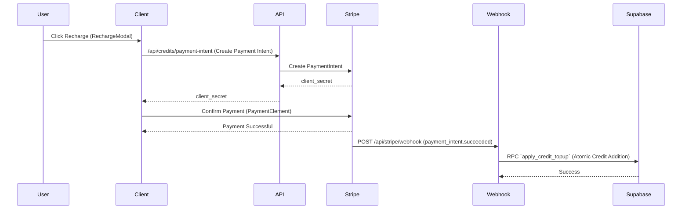

# Core Architecture

[中文](./architecture_zh.md) | **English**

Imago utilizes the Next.js App Router architecture, tightly integrating frontend and backend.

## 1. Directory Structure

```
├── app/
│   ├── api/             # Next.js API Routes (Serverless Functions)
│   │   ├── generate/    # Core generation logic
│   │   ├── stripe/      # Payment callbacks
│   │   └── webhooks/
│   ├── components/      # React UI Components
│   ├── mode/            # Core Business Mode Pages (Fantasy, Freeform, Flow)
│   └── globals.css      # Tailwind Global Styles
├── lib/
│   ├── prompt/          # Prompt Construction & Processing Logic
│   ├── models.ts        # Model Definitions
│   └── presets.ts       # Style Presets
├── providers/           # AI Model Provider Adapter Layer
└── supabase/
    └── migrations/      # Database Migration Files
```

## 2. Prompt Building System (`lib/prompt`)

Prompts are the core of image generation. Imago's Prompt System consists of the following layers:

1.  **User Input**: Basic description.
2.  **Style Preset**: `lib/presets.ts` defines the base tone Prompt for different styles.
3.  **Modifier**: Automatically appends high-quality descriptors ("masterpiece, best quality, 8k...") and negative prompts ("nsfw, lowres, bad anatomy...").
4.  **Humanizer**: In `lib/prompt/humanizer.ts`, we attempt to convert short tag-style prompts into natural language descriptions to adapt to next-generation models (like Flux/SDXL).

## 3. Payment & Credit Flow



## 4. User Authentication (Auth)

Uses Supabase Auth.

*   **Frontend**: `SupabaseProvider` encapsulates Session context.
*   **API**: `/api/*` routes obtain Server Session via `createClient`, verifying `user.id`, with data security guaranteed by Postgres RLS (Row Level Security).
