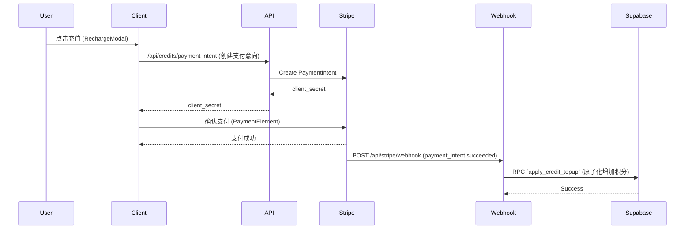

# 核心架构 (Architecture)

[English](./architecture.md) | **中文**

Imago 采用 Next.js App Router 架构，前后端紧密结合。

## 1. 目录结构

```
├── app/
│   ├── api/             # Next.js API Routes (Serverless Functions)
│   │   ├── generate/    # 核心生成逻辑
│   │   ├── stripe/      # 支付回调
│   │   └── webhooks/
│   ├── components/      # React UI 组件
│   ├── mode/            # 核心业务模式页面 (Fantasy, Freeform, Flow)
│   └── globals.css      # Tailwind 全局样式
├── lib/
│   ├── prompt/          # Prompt 构建与处理逻辑
│   ├── models.ts        # 模型定义
│   └── presets.ts       # 风格预设
├── providers/           # AI 模型服务商适配层
└── supabase/
    └── migrations/      # 数据库迁移文件
```

## 2. Prompt 构建系统 (`lib/prompt`)

Prompt 是图像生成的核心。Imago 的 Prompt 系统包含以下层级：

1.  **用户输入**: 基础描述。
2.  **Style Preset (风格预设)**: `lib/presets.ts` 定义了不同风格的基调 Prompt。
3.  **Modifier (修饰符)**: 自动追加高质量画质词（"masterpiece, best quality, 8k..."）和负向提示词（"nsfw, lowres, bad anatomy..."）。
4.  **Humanizer**: 在 `lib/prompt/humanizer.ts` 中，我们尝试将简短的标签式提示词转换为自然语言描述，以适应新一代模型（如 Flux/SDXL）。

## 3. 支付与积分流 (Payment Flow)



## 4. 用户鉴权 (Auth)

使用 Supabase Auth。
*   **前端**: `SupabaseProvider` 封装了 Session 上下文。
*   **API**: `/api/*` 路由通过 `createClient` 获取服务端 Session，验证 `user.id` 后由 Postgres RLS (Row Level Security) 保证数据安全。
